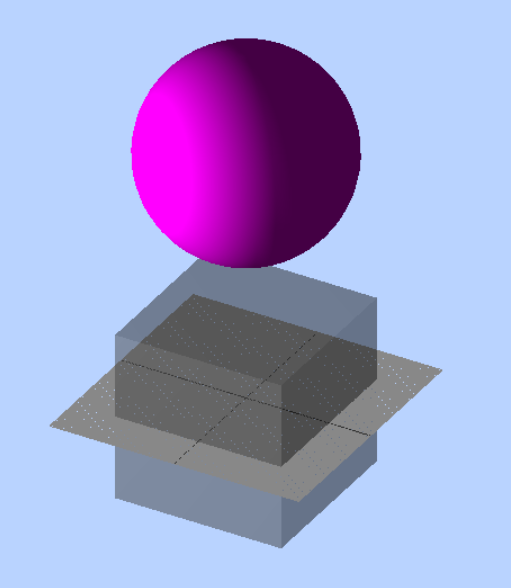

# 2021-11-02 初识Three.js
## Three.js是什么？
```
Three.js是基于原生WebGL封装运行的三维引擎，市面上使用最广泛的三维可视化框架。
```
## 如何使用Three.js
1. 首先通过官网下载[three.js](http://www.yanhuangxueyuan.com/versions/threejsR92/build/three.js)，并将其引入。
```
<!DOCTYPE html>
<html lang="en">
<head>
  <meta charset="UTF-8">
  <meta http-equiv="X-UA-Compatible" content="IE=edge">
  <meta name="viewport" content="width=device-width, initial-scale=1.0">
  <title>初始Three.js</title>
  <!--引入three.js三维引擎-->
  <script src="./three.js"></script>
  <style>
    body {
      margin: 0;
      overflow: hidden;
      /* 隐藏body窗口区域滚动条 */
    }
  </style>
</head>
<body>
</body>

<script>
/**
 * TODO: 3D逻辑代码
 */
</script>
</html>

```
2. 创建虚拟场景，在其场景网络模型和光照，网络模型中定义几何体形状和材质，设置光照的颜色和光照类型。
```
<script>
  // 创建场景对象Scene
  const scene = new THREE.Scene()

  /**
    * 创建网络模型
    */
  // 创建立方体几何对象
  const geometry = new THREE.BoxGeometry(100, 100, 100)
    // 素材对象
  const material = new THREE.MeshLambertMaterial({
    color: 0x444444
  })
  // 网络模型对象
  const mesh = new THREE.Mesh(geometry, material)
  // 将网络模型添加至场景中
  scene.add(mesh)

  /**
    * 光源设置
    */
  // 点光源
  const point = new THREE.PointLight(0xffffff)
  point.position.set(400, 200, 300) // 点光源位置
  scene.add(point)

  /**
    * 环境光
    */
  const ambient = new THREE.AmbientLight(0x444444)
  scene.add(ambient)
</script>
```
3. 创建虚拟相机，设置相机位置、视线方向、投影方式，如何人拍照需要调整角度位置和显示效果不同，成像也不同。
```
<script>
  ...

  /**
    * 相机设置
    */
  const width = window.innerWidth // 窗口宽度
  const height = window.innerHeight // 窗口高度
  const k = width / height // 窗口宽高比
  const s = 200 // 三维场景显示范围控制系数，系数越大，显示范围越大
  // 创建相机对象
  const camera = new THREE.OrthographicCamera(-s * k, s * k, s, -s, 1, 1000)
  camera.position.set(200, 300, 200) // 设置相机位置
  camera.lookAt(scene.position) // 设置相机方向(指场景对象)
</script>
```
3. 创建渲染器，渲染器通过虚拟场景和虚拟相机可以渲染操作成三维图形。
```
<script>
  ...

  /**
    * 创建渲染器对象
    */
  const renderer = new THREE.WebGLRenderer()
  renderer.setSize(width, height) // 设置渲染区域尺寸
  renderer.setClearColor(0xb9d3ff, 1) // 设置背景颜色
  document.body.appendChild(renderer.domElement) // body元素中插入canvas对象
  // 执行渲染操作 指定场景、相机为参数
  renderer.render(scene, camera)

  let T0 = new Date() // 上次时间
  // 渲染函数
  function render() {
    const T1 = new Date() // 本次时间
    const t = T1 - T0 // 时间差
    T0 = T1 // 把本次时间赋值给上次时间
    requestAnimationFrame(render)
    renderer.render(scene, camera) // 执行渲染操作
    mesh.rotateY(0.001 * t) // 每次绕y轴转0.01弧度
  }

  render()
</script>
```
4. 最终我们得到了一个旋转的三维图像。

<br/>
<br/>
## 最后我们可以通过<a href="http://www.webgl3d.cn/Three.js">Three.js官网教程</a>进行学习。
<br />

# 2021-11-03
## 使用React开发Three
### 安装依赖：
```
yarn i three
yarn i -D @types/thress
```
1. 引入Three依赖
```
import {
  Scene,
  OrthographicCamera,
  WebGLRenderer,
  BoxGeometry,
  MeshLambertMaterial,
  Mesh,
  PointLight,
  AmbientLight,
  SphereGeometry,
  GridHelper
} from 'three'
import { OrbitControls } from 'three/examples/jsm/controls/OrbitControls.js';
```
2. 给正方体添加半透明
```
...

/**
  * 创建网络模型
  */
// 创建立方体几何对象
const geometry = new BoxGeometry(100, 100, 100)
  // 素材对象
const material = new MeshLambertMaterial({
  color: 0x444444
})
material.opacity = 0.5 // 半透明为0.5
material.transparent = true // 允许透明度

...
```
3. 修改render函数
```
...

function render() {
  renderer.render(scene,camera);//执行渲染操作
  requestAnimationFrame(render);//请求再次执行渲染函数render
}
render()
const controls = new OrbitControls(camera,renderer.domElement);//创建控件对象
controls.addEventListener('change', render);//监听鼠标、键盘事件
```
4. 添加额外球体和辅助坐标系
```
...

// 球体网格模型
const geometry2 = new SphereGeometry(60, 40, 40);
const material2 = new MeshLambertMaterial({
  color: 0xff00ff
});
const mesh2 = new Mesh(geometry2, material2); //网格模型对象Mesh
mesh2.translateY(150); //球体网格模型沿Y轴正方向平移120
scene.add(mesh2);

// 辅助坐标系
var gridHelper = new GridHelper(150, 150, 0x2C2C2C, 0x888888);
scene.add(gridHelper);
```
5. 最终成像：

