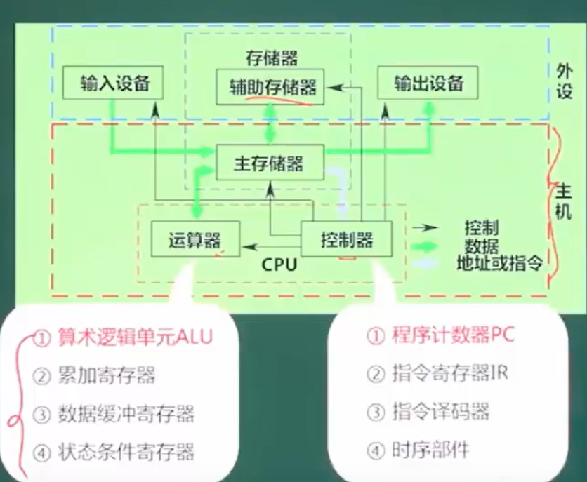
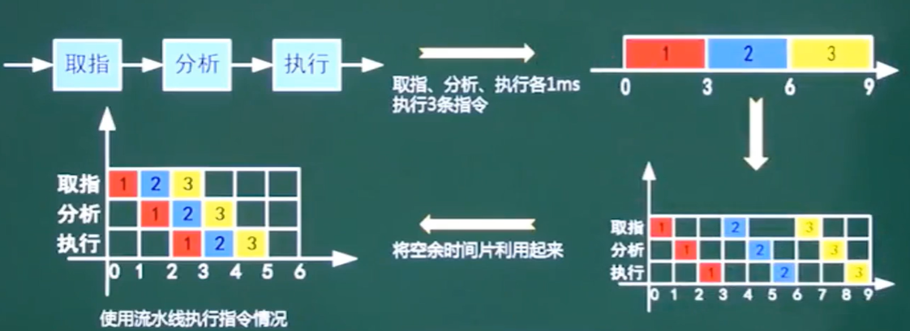
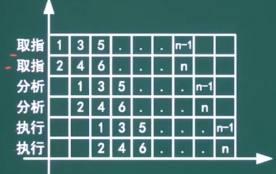
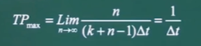
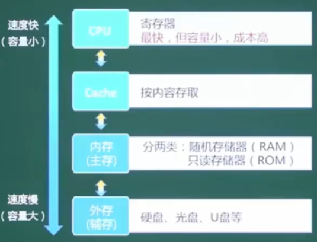
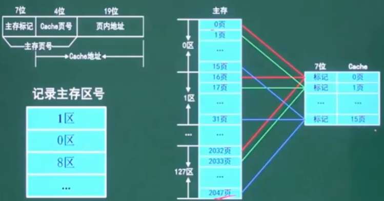
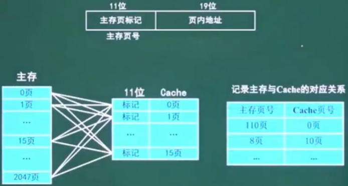
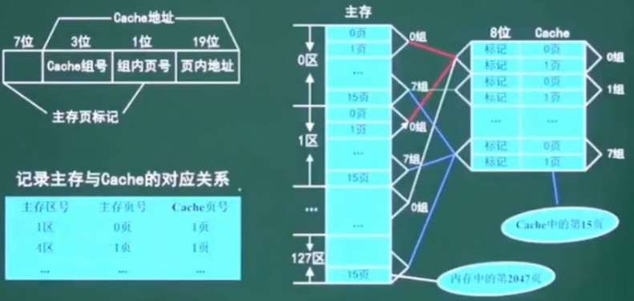
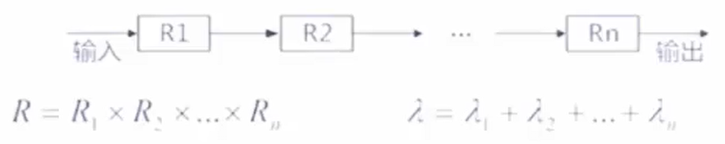
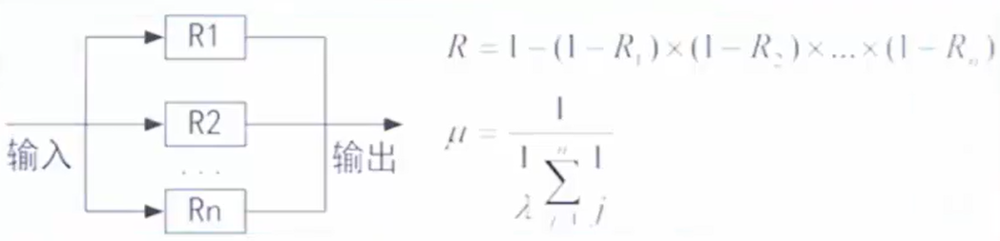

# R进制

## 二进制
### 二进制是从`0`和`1`组成的数字，由于早期计算机由晶体管组成，晶体管只能传送两种信号，所以将这两种信号代表0和1。逢二进一。

## 八进制
### 八进制是从`0`到`7`组成的数，逢八进一。八进制的数和二进制的数可以用按位对应，7的二进制是111，二进制转八进制按每3位来计算，如：二进制010110转位八进制，将010110拆为`010` `110`，010转为八进制是2，110转为八进制是6，所以010110转为八进制是26。

## 十进制
### 我们常用的数字就是由十进制组成。

## 十六进制
### 十六进制是从0~9A-F之间的数，由于10是两位，无法在计算机中表示，所以使用大写英文A到F表示10到15。逢十六进一。

# 按权展开法
### R进制转十进制使用按权展开法，将R进制的每一位数值用R^k形式表示，既幂的底数为R，指数为k，k与该位和小数点之间的距离有关。当该位位于小数点左边，k值是该位2和小数点之间数码的个数，当该位位于小数点右边，k值位负值，其绝对值是该位和小数点之间数码的个数加1。

## 二进制转十进制
先从最高位开始，依次将十进制数的每一位和2的每一位相乘，相乘的结果再加上原来的值，直到最后一位。

**10100转十进制**：
* 1010**0**:  0 * 2^0 = 0
* 101**0**0:  0 * 2^1 = 0
* 10**1**00:  1 * 2^2 = 4
* 1**0**100:  0 * 2^3 = 0
* **1**0100:  1 * 2^4 = 16
* 10100 = 4 + 16 = 20

## 十进制转为二进制
### 短除法。十进制每一位除以2，然后求余数，余数代表二进制的每一位，在从后到前的形式书写成二进制。
**18转二进制**：
```base
18 / 2 = 9 ... 0   ↑
9 / 2 = 4  ... 0   |
4 / 2 = 2  ... 1   | 从下往上写
2 / 2 = 1  ... 0   |
1 / 2 = 0  ... 1   |
```
十进制18转为二进制就是10100

# 数值表示
## 原码
### 最高位数即符号位`0`和`1`表示正数和负数。如机器字长为八位，最高位的`0`0000001来表示。

## 反码
### 正数的反码是它本身，负数的反码是除符号位以外的数取反。

## 补码
### 正数的补码是它本身，负数的补码是除符号位以外的数进一。

## 移码
### 在补码基础上，符号位取反。

|     | 数值1 | 数值-1  | 1 - 1 |
| --- | --- | --- | --- |
| 原码 | 0000 0001 | 1000 0001 | 1000 0010 |
| 补码 | 0000 0001 | 1111 1110 | 1111 1111 |
| 反码 | 0000 0001 | 1111 1111 | 0000 0000 |
| 移码 | 1000 0001 | 0111 1111 | 1000 0000 |

## 数组的表示范围
| 码制 | 定点整数 | 定点小数 |
| --- | --- | --- |
| 原码 | -(2^n-1 - 1) \~ +(2^n-1 - 1) | -(1 - 2^-(n-1)) \~ +(1 - 2^-(n-1)) |
| 反码 | -(2^n-1 - 1) \~ +(2^n-1 - 1) | -(1 - 2^-(n-1)) \~ +(1 - 2^-(n-1)) |
| 补码 | -2^n-1 \~ +(2^n-1) | -1 \~ +(1 - 2^-(n-1)) |
| 移码 | -2^n-1 \~ +(2^n-1) | -1 \~ +(1 - 2^-(n-1)) |

## 定点正数
```base
当n=8，也就是一共有8个数位时：
原码：-(2^n-1 - 1) ~ +(2^n-1 - 1)
      -127 ~ +127
转为二进制:
1111 1111 ~ 0111 1111
补码：
1000 0000 ~ 0111 1111
其中-128的补码位1000 0000是人为规定的。
```

## 定点小数
```base
当n=8，也就是一共有8个数位时：
原码：-(1 - 2^-(n-1)) ~ +(1 - 2^-(n-1))
      -0.11111111 ~ +0.11111111
补码：-1 ~ +0.11111111
其中-1的补码为1000 0000是人为规定
```

# 浮点运算
## 浮点数表示
### N = 尾数 * 基数^指数
```base
3.14 * 10^3 => 3.14(尾数) 10(基数) 3次幂(指数)
```
# 计算机结构
### 计算机五大件：运算器、控制器、存储器、输入设备、输出设备
### 存储器分为主存(主存储器)和辅存(辅助存储器)。主存的是内存，辅存的是外存(磁盘、光盘等)。
### 输入输出设备分为输入设备和输出设备。输入设备是键盘、鼠标、键鼠套装等，输出设备是显示器、打印机、扫描仪等。




### **运算器**和**控制器**是计算机中重要的部分。
## 运算器：
1. **算术逻辑单元ALU：数据的算术运算和逻辑运算。**
2. 累加寄存器AC：通用寄存器，为ALU提供一共工作区，用在暂存数据。
3. 数据缓冲寄存器DR：写内存时，暂存指令或数据。
4. 状态条件寄存器SR：存状态标志与暂停标志。(**争议：也有将其归为控制器的**)

## 控制器：
1. **程序计数器PC：存储下一条要执行指令的地址。**
2. 指令寄存器IR：存储即将执行的指令。
3. 指数编译器ID：对指令中的操作码字段进行分析解释。
4. 时序部件：提供时序控制信号。

# 计算机体系结构分类
## Flynn分类体系(必考)：

| 体系结构类型 | 结构 | 关键特性 | 代表 |
| --- | --- | --- | --- |
| 单指令流单数据流<br>SISD | 控制部分：一个<br>处理器：一个<br>主存储模块：一个 | | 单处理器系统 | 
| 单指令流多数据流<br>SIMD | 控制部分：一个<br>处理器：多个<br>主存储模块: 多个 | 各处理器以异步<br>的形式执行同一<br>条指令 | 并行处理机<br>**阵列处理机**<br>超级向量处理机 |
| 多指令单数据流<br>MISD | 控制部分：多个<br>处理器：一个<br>主存储模块：多个 | 被证明不可能，<br>至少是不实际 | 目前没有，有文献称<br>**流水线计算机**为此类 |
| 多指令多数据流<br>MIMD | 控制部分：多个<br>处理器：多个<br>主存储模块：多个 | 能够实现**任务**、<br>**作业**、**指令**等各级全面并行 | 多处理机系统<br>多计算机 |

## 指令的基本概念
### 一条指令就是机器语言的一个语句，它是一组有意义的二进制代码，指令的基本格式如下：
| 操作码字段 | 地址码字段|
| --- | --- |

### 操作码部分指出了计算机要执行什么性质的操作，如加法、减法、取数、存数等。地址码字段需要包含各操作数的地址及操作结果的存放地址等，从其地址结构的角度可以分为三地址指令、二地址指令、一地址指令和零地址指令。

### 三地址指令(a + b = c):
| OP | A1 | A2 | A3 |
| --- | --- | --- | --- |
| + | a | b | c |

### 二地址指令(a += b):
| OP | A1 | A2 |
| --- | --- | --- |
| + | a | b |

### 一地址指令(a++):
| OP | A1 |
| --- | --- |
| ++ | a |

### 零地址指令：宕机

## 寻址方式
### 立即寻址方式：
```base
特点：操作数直接在指令中，速度快，灵活性差。
```

### 直接寻址方式：
```base
特点：指令中存放的是操作数的地址。
```

### 间接寻址方式：
```base
特点：指令中存放了一个地址，这个地址对应的内容是操作数的地址。
```

### 寄存器寻址方式：
```base
特点：寄存器存放操作数。
```

### 寄存器间距寻址方式：
```base
特点：寄存器内存放的是操作数的地址。
```

## CISC和RISC(常考)
| 指令系统类型 | 指令 | 寻址方式 | 实现方式 | 其他 |
| --- | --- | --- | --- | --- |
| CISC(复杂) | 数量多，使用频率差<br>别大，可变长格式 | 支持多种 | 微程序控制技<br>术(微码) | 研制周期长 |
| RISC(精简) | 数量少，使用频率接<br>近，定长格式，大部<br>分为单周期指令，操<br>作寄存器，只有<br>Load/Store操作内存 | 支持方式少 | 增加了通用寄<br>存器，硬布线<br>逻辑控制为主<br>适合采用流水<br>线 | 优化编译，有效<br>支持高级语言 |

## CISC和RISC比较，分哪些维度？
### 指令数量、指令使用频率、寻址方式、寄存器、流水线支持、高级语言区别。
### CISC: 复杂、指令数量多、频率差别大、多寻址。
### RISC: 精简、指令数量少、操作寄存器、单周期、少寻址、多通用寄存器、流水线。

## 流水线(重要)
### 流水线是指在程序执行时**多条指令重叠进行操作**的一种准并行处理实现技术。各种部件同时处理是针对不同指令而言的，它们可同时为多条指令的不同部分进行工作，以提高各部件的利用率和指令的平均执行速度。
### 相关参数计算：**流水线执行时间计算、流水线吞吐率**、流水线加速比、流水线效率。



## 流水线计算公式：
### 流水线周期为执行最长的一段(取指、分析、执行中最长的一段)
### 流水线计算公式：1条指令执行时间 + (指令条数 - 1) * 流水线周期
### **理论公式：(t1 + t2 ... + tk) + (n - 1) *  Δt**
### 实践公式：k * Δt + （n - 1) * Δt (理论公式没有结果时使用实际公式)

### 一条指令的执行过程可以分解为取指、分析和执行三步，在取指时间t取指=3Δt，分析时间t分析=2Δt，执行时间t执行=4Δt情况下，若按串行方式执行，则10条指令全部执行需要( )Δt，若按流水线的方式执行，流水线周期为( )Δt，则10条指令全部执行完需要( )Δt。
```base
串行方法执行10条指令：(3 + 2 + 4) * 10 = 90Δt
流水线周期是：4Δt
并行方法执行10条指令：(3 + 2 + 4) + (10 - 1) * 4Δt = 45Δt
```

## 超标量流水线
### 在原本的流水线基础多加一条流水线。



## 流水线吞吐率计算(常考)
### 流水线的吞吐率(Though Put rate，TP)是指在**单位时间内流水线所晚餐的任务数量或输出的结果数量**，计算流水线吞吐率的基本公式如下：
### TP = 指令条数 / 流水线执行时间
### 流水线最大吞吐率：



## 层次化存储结构


## Cache(高速缓冲存储器)
### 在计算机体系中，Cache是访问速度最快的层次(若有寄存器，则寄存器最快)。
### 使用Cache改善系统性能的依据是程序的**局部性原理**。
* 时间局部性
* 空间局部性

### 如果以h代表对Cache的访问命中率，t1表示Cache的周期时间，t2表示主存储器周期时间，以读操作为例，使用“Cache + 主存储器”的系统的平均周期为t3，则：
      t3 = h * t1 + (1 - h) * t2
      其中，(1 - h)又称失效率(未命中率)

## Cache映像
### 直接相联映像：硬件电路比较简单，但冲突率很高。


### 全相联映像：电路难以设计和实现，只使用于较小的cache，冲突率较低。


### 组相联映像：直接相联和全相联的折中。


### **地址映像**是将主存与Cache的存储空间划分为若干个大小相同的页(或者称为块)。
      例如，某机的主存容量为1GB，划分为2048页，每页512KB。Cache容量为8MB，划分为16页，每页512KB。

# 主存
## 编址与计算
### 存储单元
### 按字编址：存储体的存储单元是字存储单元，即最小寻址单位是一个字。
### 按字节编址：存储体的存储单元是字节存储单元，即最小寻址单位是一个字节。1Byte = 8位(bit)。

### 根据存储器所要求的容量和选定的存储芯片的容量，就可以计算出所需要芯片的总数，即：
      总片数 = 总容量 / 每片容量

### 例：若内存地址区间为4000H~43FFH，每个存储单元可存储16位二进制数，该内存区域用4片存储器芯片构成，则构成该内存所用的存储器芯片的容量是多少？
```
总容量：(43FFH - 4000H + 1) * 16bit = 1024 * 16bit
总片数：1024 * 16bit / 4 = 256 * 16bit
```

# 总线
### 一条总线**同一时刻仅允许一个设备发送，但允许多个设备接收。**

## 总线分类
#### **数据总线(Data Bus)**: 在CPU和RAM之间来回传送需要处理或是需要存储的数据。

### **地址总线(Address Bus)**：用来指定在RAM(Random Access Memory)之中储存的数据的地址。

### **控制总线(Control Bus)**：将微处理器控制单元(Control Unit)的信号，传送到周边设备，一般常见的为USB Bus和1394 Bus。

# 串联系统
### 只要有一条数据错误则无法运行下去。


# 并联系统
### 只要有一条数据正确则可以继续运行。
