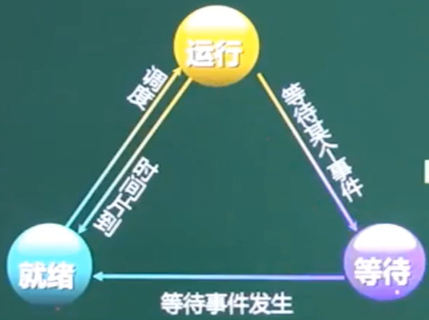
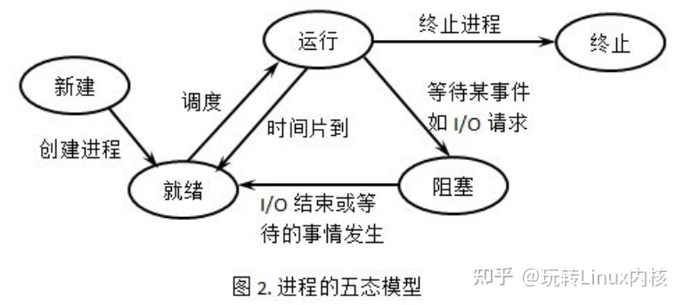
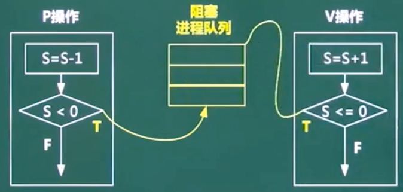

# 进程管理

### 进程是程序在一个数据集合上运行的过程，它是系统进行资源分配和调度的一个独立单位。它由程序块、进程控制块( PCB )和数据块三部分组成。

### 进程与程序的区别:进程是程序的一次执行过程,没有程序就没有进程。

### 程序是完成某个特定功能的一系列程序语句的集合,只要不被破坏，它就永远存在。程序是一个静态的概念,而进程是一个动态的概念,它由创建而产生,完成任务后因撤销而消亡;进程是系统进行资源分配和调度的独立单位,而程序不是。

# 进程的状态
### 三态模型：



### 五态模型：


# PV操作
### 临界资源:诸进程间需要互斥方式对其进行共享的资源,如打印机、磁带机等
### 临界区:每个进程中访问临界资源的**那段代码称为临界区**
### 信号量:**是一种特殊的变量**
### **P是荷兰语的Passeren，V是荷兰语的Verhoog.**


### 多个进程共享一台打印机问题(互斥模型):
```
P(S)
    使用打印机;
    V(S);
    后续代码;

    互斥信号量S的初值为1
```