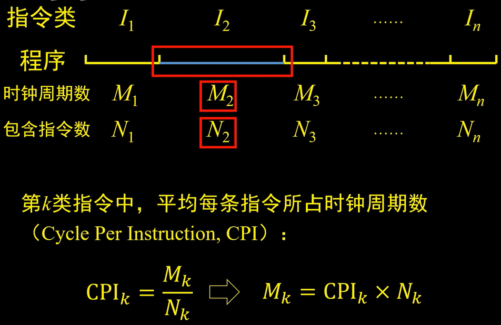
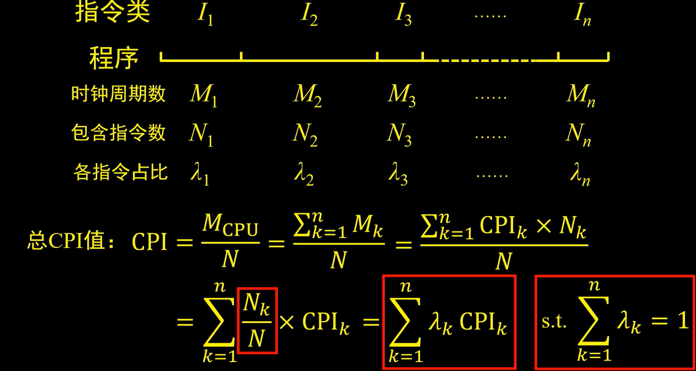
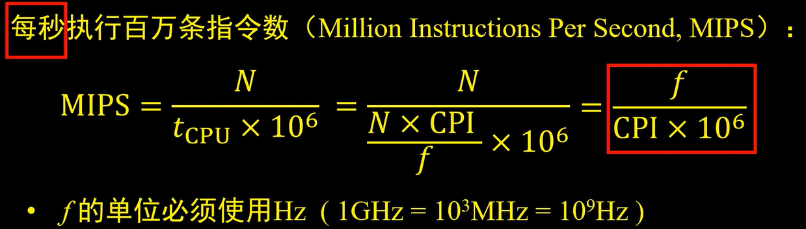

# 计算机机构

### **运算器**和**控制器**是计算机中重要的部分。
## 运算器：
1. **算术逻辑单元ALU：数据的算术运算和逻辑运算。**
2. 累加寄存器AC：通用寄存器，为ALU提供一共工作区，用在暂存数据。
3. 数据缓冲寄存器DR：写内存时，暂存指令或数据。
4. 状态条件寄存器SR：存状态标志与暂停标志。(**争议：也有将其归为控制器的**)

## 控制器：
1. **程序计数器PC：存储下一条要执行指令的地址。**
2. 指令寄存器IR：存储即将执行的指令。
3. 指数编译器ID：对指令中的操作码字段进行分析解释。
4. 时序部件：提供时序控制信号。


# CPI(平均每条指令所占时钟周期)



# MIPS(每秒执行百万条指令数)
### N是指令总数，n是指令类别数
### f的单位必须使用Hz (1M=10^6, 1G=10^69


# 中断向量
### 中断向量就是指中断服务程序的入口地址，它存放着一条跳转到中断服务入口地址的跳转指令。

# 浮点运算
### 浮点数运算过程：对阶->尾数运算->规格化。
### 其中对阶的过程：小数向大数看齐，尾数右移。

# 认证与加密
### 认证一般有账户名/口令认证、使用摘要算法认证和基于PKI的认证。
### 认证只能防止主动攻击，不能防止被动攻击。

# 访问控制
### **访问控制**（Access Control）指系统对用户身份及其所属的预先定义的策略组限制其使用数据资源能力的手段。通常用于系统管理员控制用户对服务器、目录、文件等网络资源的访问。访问控制是系统保密性、完整性、可用性和合法使用性的重要基础，是网络安全防范和资源保护的关键策略之一，也是主体依据某些控制策略或权限对客体本身或其资源进行的不同授权访问。
### 访问控制的**主要目的**是限制访问主体对客体的访问，从而保障数据资源在合法范围内得以有效使用和管理。为了达到上述目的，访问控制需要完成两个任务：识别和确认访问系统的用户、决定该用户可以对某一系统资源进行何种类型的访问。
### 访问控制包括三个要素：主体、客体和控制策略。
1. 主体S（Subject）。是指提出访问资源具体请求。是某一操作动作的发起者，但不一定是动作的执行者，可能是某一用户，也可以是用户启动的进程、服务和设备等。
2. 客体O（Object）。是指被访问资源的实体。所有可以被操作的信息、资源、对象都可以是客体。客体可以是信息、文件、记录等集合体，也可以是网络上硬件设施、无限通信中的终端，甚至可以包含另外一个客体。
3. 控制策略A（Access Control Policy）。是主体对客体的相关访问规则集合，即属性集合。访问策略体现了一种授权行为，也是客体对主体某些操作行为的默认。

### 访问控制的**主要功能**包括：保证合法用户访问受权保护的网络资源，防止非法的主体进入受保护的网络资源，或防止合法用户对受保护的网络资源进行非授权的访问。访问控制首先需要对用户身份的合法性进行验证，同时利用控制策略进行选用和管理工作。当用户身份和访问权限验证之后，还需要对越权操作进行监控。因此，访问控制的内容包括认证、控制策略实现和安全审计。

# 网关协议
### **RIP**(路由信息协议)是一种内部网关协议(IGP)，是一种动态路由选择协议，用于自治系统(AS)内的路由信息的传递。
### **OSPF**(开放式最短路径优先)是一个内部网关协议，用于在单一自治系统内决策路由。是对链路状态路由协议的一种实现，隶属内部网关协议，故运作于自治系统内部。
### **BGP**(边界网关协议)是运作于TCP上的一种自治系统的路由协议。BGP是唯一一个用来处理像因特网大小的网络协议，也是唯一能够妥善处理好不相关路由域间的多路连结的协议。
### **UDP**：传输层协议。

# 数据特征
### 数据的**机密性(保密性)**：是指数据在传输过程不能被非授权者偷看。
### 数据的**完整性**：是指数据在传输过程中不能被非法篡改。
### 数据的**真实性**：是指信息的发送者身份的确认或系统中有关主体的身份确认，这样可以保证信息的可信度。
### **可用信**：指发送者和接受者双方的通信方式正常。

# Windows命令
### **ipconfig(linux: ifconfig)**：显示TCP/IP网络配置值，如IP地址、MAC地址、网关地址等。
### **tracert(linux: traceroutr)**：用于确定IP数据包括访问目标所采取的路径，若网络不通，能定位到具体哪个结点不通。
### **netstat**：用于显示网络连结、路由表和网络接口信息。
### **nslookup**：查询DNS记录。

# 软件著作权

### 著作中修改权、著名权、保护作品完整权都是永久保护的。

# 数据字典
### 数据字典会对数据流图中元素进行定义说明。

# 良好的启发式设计原则
### 模块化设计要求高内聚、低耦合，模块独立体现的就是高内聚低耦合。
### 在结构化设计中，系统由多个逻辑上相对独立的模块组成，在模块规划分时需要遵循如下原则
1. 模块的大小要适中。系统分解时需要考虑模块的规模，过大的模块可能导致系统分解不充分，其内部可能包括不同类型的功能，需要进异步划分，尽量使得各个模块的功能单一；过小的模块将导致系统的复杂度增加，模块之间的调用过于频繁，反而降低了模块的独立性。不是越小越好。
2. 模块的扇入和扇出要合理。模块的扇入指模块直接上级模块的个数。模块的直属下级模块个数即为模块的扇出。
3. 深度和宽度适当。深度表示软件结构中模块的层.数,如果层数过多,则应考虑是否有些模块设计过于简单，看能否适当合并。宽度是软件结构中同一个层次上的模块总数的最大值，-般说来，宽度越大系统越复杂,对宽度影响最大的因素是模块的扇出。在系统设计时,需要权衡系统的深度和宽度，尽量降低系统的复杂性,减少实施过程的难度，提高开发和维护的效率。需要控制模块接的复杂性。
### 尽力使模块的作用域在其控制域之内。模块控制域:这个模块本身以及所有直接或间接从属于它的模块的集合。模块作用域:指受该模块内一个判定所影响的所有模快的集合。

# COCOMO II模型
### COCOMO模型也需要使用规模估算信息，息，体系结构阶鲁点功能点和代码行。早期设计的段模型使用的是方能装应用组装模型使用的是对象点，码行。体系结构横型把工作量集功能点可以转换为代示为代码行数。

# 编译型语言处理过程；
### 预处理->编译->汇编->链接

# 逻辑地址转换为物理地址
## 十六进制使用公式：
**逻辑地址 = 页号 + 页内地址**
**物理地址 = 块号 + 页内地址**

## 非十六进制使用公式：
**物理地址 = 块号 * 页内大小 + 页内地址**
**页号 = 逻辑地址 / 页内大小字节 = (取整数)**
**页内地址 = 逻辑地址 % 页内大小字节 = (取余数)**

### 1、十六进制

#### 设某用户的编程空间共32个页面，每页为1KB，内存容量为16KB。假定用户程序的页表如下所示。请计算逻辑地址0A5CH所对应的物理地址。（要写出计算过程）

| 页号 | 块号 |
| --- | --- |
| 0 | 5 |
| 1 | 10 |
| 2 | 4 |
| 3 | 7 |

### 【分析】
#### 逻辑地址为0A5CH；
#### 页内地址的位数通过“每页为1KB”转换成2的n次幂去求解，n次幂=位数。
#### 页号的位数通过逻辑地址的位数减去页内地址的位数，即16-页内地址的位数。

### 【解答】
```
因为 逻辑地址为0A5CH，
所以 逻辑地址转换为2进制为 0000 1010 0101 1100；
因为 1KB=2^10B，
所以 页内地址的位数=10；
所以 页内地址为10 0101 1100；即页号为0000 10。
因为 页号转换为10进制为2，
所以 对应的块号为4；
所以 块号的2进制为000100。
因此，物理地址= 000100 10 0101 1100，即0001 0010 0101 1100。
转换为16进制为125CH。
```

### 【说明】
```
其实这题逻辑地址转换为物理地址的做法就是：
把逻辑地址的页号部分：0000 1010 0101 1100
转换成对应物理地址的块号：0001 0010 0101 1100
这样就完成了转换。
```

### 2、非十六进制

#### 在采用分页存储管理的系统中，某作业J的逻辑地址空间为4页（每页2KB），且已知该作业的页面映像表（即页表）如下：试借助地址变换图求出有效逻辑地址4865所对应的物理地址。（要写出计算过程）

| 页号 | 块号 |
| --- | --- |
| 0 | 2 |
| 1 | 4 |
| 2 | 6 |
| 3 | 8 |

### 【分析】
```
页号=逻辑地址/页面大小字节=（取整数）
页内地址=逻辑地址%页面大小字节=（取余数）
```

### 【解答】
```
页号P=4865/2K=4865/2048（转为10进制）=2，
页内地址W=4865 % 2048=769；
则通过查找页表，可知第2页放于第6块中，
因此逻辑地址4865所对应的物理地址为：
6*2048+769=13057
```