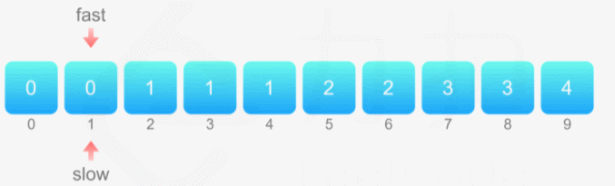

# leecode 26: 删除有序数组中的重复项
### 给你一个有序数组 nums ，请你 原地 删除重复出现的元素，使每个元素 只出现一次 ，返回删除后数组的新长度。
### 不要使用额外的数组空间，你必须在 原地 修改输入数组 并在使用 O(1) 额外空间的条件下完成。
#### 示例 1：
```
输入：nums = [1,1,2]
输出：2, nums = [1,2]
解释：函数应该返回新的长度 2 ，并且原数组 nums 的前两个元素被修改为 1, 2 。不需要考虑数组中超出新长度后面的元素。
```
#### 示例 2：
```
输入：nums = [0,0,1,1,1,2,2,3,3,4]
输出：5, nums = [0,1,2,3,4]
解释：函数应该返回新的长度 5 ， 并且原数组 nums 的前五个元素被修改为 0, 1, 2, 3, 4 。不需要考虑数组中超出新长度后面的元素。
```
### 解题思路：
1. 设置快指针和慢指针：let fast = 1, slow = 1
2. nums是一个已按升序排列的数组，快指针和上一个快指针不同时，则是新的数，则更新数组慢指针的下的数据。

```
function removeDuplicates(nums: number[]): number {
  const lenth = nums.length
  if (lenth === 0) return 0
  // 创建慢指针和快指针
  let fast = 1, slow = 1

  while (fast < lenth) {
    if (nums[fast] !== nums[fast - 1]) {
      nums[slow] = nums[fast]
      ++slow
    }
    ++fast
  }

  return slow
};
```